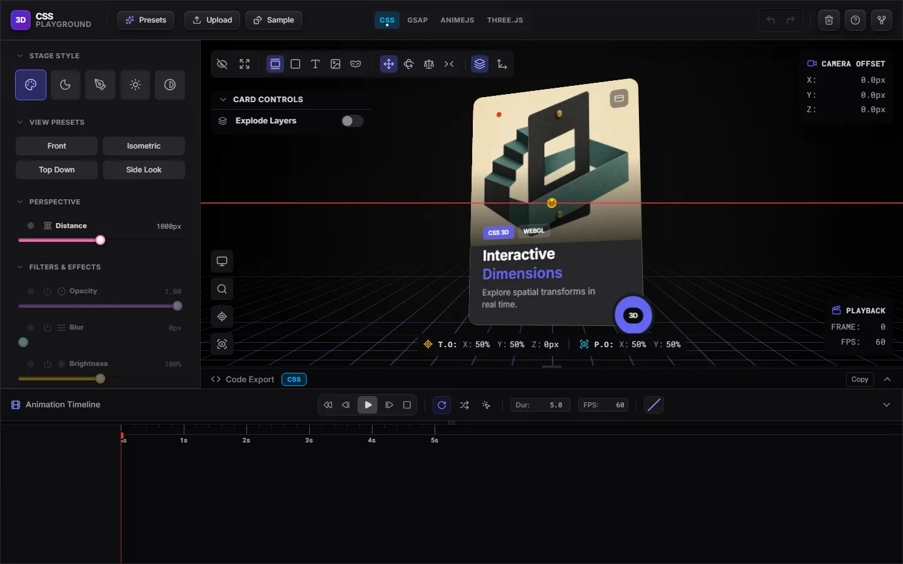
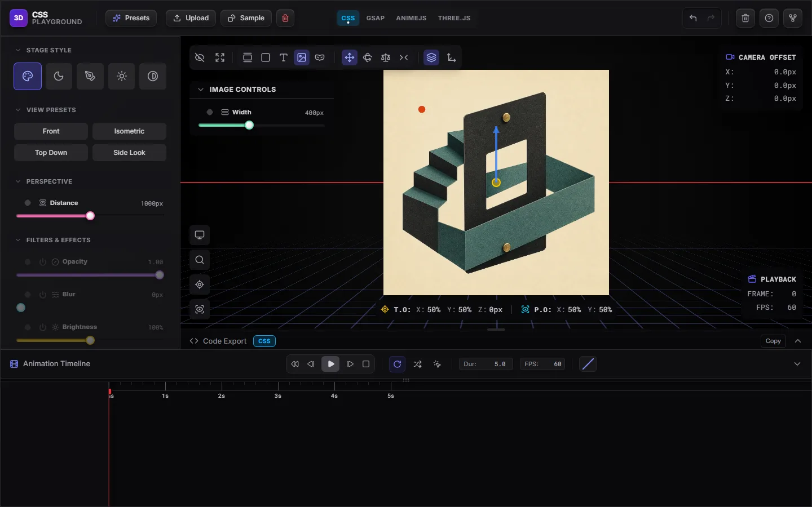
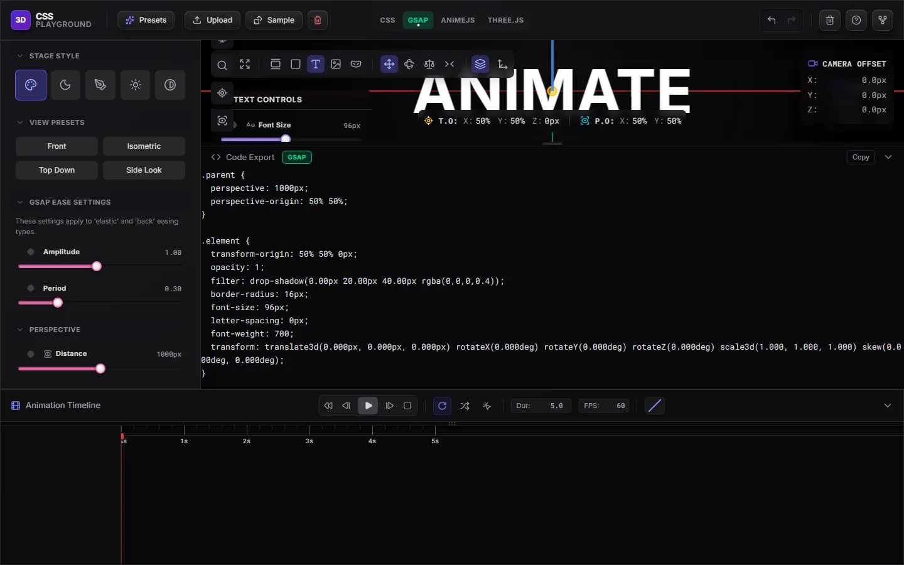
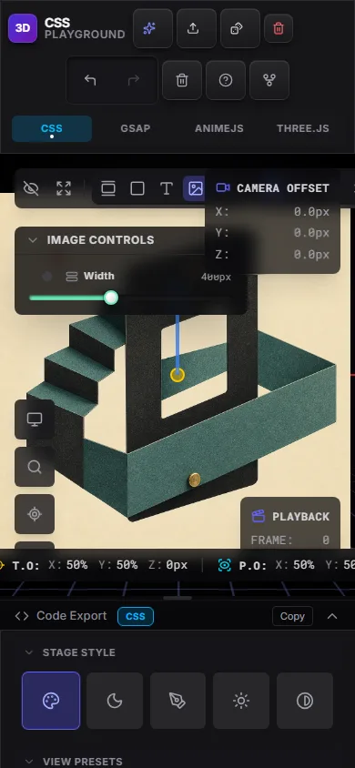

<p align="center">
  <picture>
    <source media="(prefers-color-scheme: dark)" srcset="https://shieldcn.dev/header/document.svg?title=CSS+3D+Playground&subtitle=Design%2C+animate%2C+and+export+spatial+motion&logo=css3&theme=violet&align=center&mode=dark" />
    
  </picture>
</p>

<p align="center">
  <a href="https://github.com/gvastethecreator/css-animation-playground/actions/workflows/ci.yml"></a>
  <a href="https://gvastethecreator.github.io/css-animation-playground/"></a>
  <a href="https://nodejs.org/"></a>
  <a href="https://github.com/gvastethecreator/css-animation-playground/stargazers"></a>
  <a href="LICENSE"></a>
</p>

An interactive playground to design, preview, and export 3D animations from a
visual editor with a live timeline, dual rendering engines (CSS and Three.js),
and code export for popular animation libraries.

[Open the live playground](https://gvastethecreator.github.io/css-animation-playground/) ·
[Source and issues](https://github.com/gvastethecreator/css-animation-playground)

The project uses **pnpm on Node.js** with **Vite+ on Vite 8**,
**React 19 + TypeScript**, **Tailwind CSS 4**, **Vitest 4**, **OXC**
(`oxlint` + `oxfmt`), and recommends **GSAP** as the primary export /
animation target.

## Product tour

| Card workbench                                                                                           | Image playground                                                                                                     |
| -------------------------------------------------------------------------------------------------------- | -------------------------------------------------------------------------------------------------------------------- |
|    |   |
| **GSAP export**                                                                                          | **Responsive editor**                                                                                                |
|  |  |

## Features

- **Dual rendering**: edit and preview with the **CSS** engine or the
  **Three.js** engine, on the same state.
- **Visual timeline** with keyframes, multi-select, scrubbing, and per-track
  easing controls.
- **Transform controls** for perspective, translate, rotate, scale, skew,
  filters, and appearance.
- **Local persistence** of the document and undo/redo history with
  automatic session restore.
- **Media support**: image, video (`.webm`), and `.glb` / `.gltf` 3D models.
- **Code export** to CSS, GSAP, Anime.js, and Three.js.
- **Tokenized design system** in Tailwind for consistent visual utilities.
- **Automated quality gates**: typecheck, lint, test, build, and local
  log files.

## Stack

| Layer                     | Tool                                                        |
| ------------------------- | ----------------------------------------------------------- |
| Runtime                   | React 19 + TypeScript                                       |
| Dev / build               | Vite+ on Vite 8                                             |
| Styling                   | Tailwind CSS 4                                              |
| UI state                  | Zustand 5 (small, UI-only state)                            |
| History / persistence     | Local hooks (`useHistoryManager`, `useStageElementManager`) |
| 3D                        | Three.js                                                    |
| Recommended animation lib | GSAP                                                        |
| Tests                     | Vitest 4 + Testing Library + jsdom                          |
| Lint / format             | OXC (`oxlint`, `oxfmt`)                                     |
| Package manager           | pnpm                                                        |

## Quick start

### Requirements

- **pnpm** `>= 11.21.0`
- **Node.js** `>= 22.22.2` (required by the current test environment)

### Install

```bash
pnpm install
```

### Develop

```bash
pnpm run dev
```

The local server defaults to `http://127.0.0.1:3000`. Set `VITE_HOST` only
when the development server must be reachable from another interface.

The editor is local-first. Documents and history stay in browser storage, and
uploaded media is processed in the current browser session. There are no
accounts, analytics, or application telemetry.

## Scripts

The most important scripts are listed below. Several of them also write
timestamped logs to `logs/` via `scripts/run-with-log.mjs`.

| Script                   | Description                              |
| ------------------------ | ---------------------------------------- |
| `pnpm run dev`           | Start the dev server with Vite+          |
| `pnpm run check`         | Run the integrated Vite+ checks          |
| `pnpm run typecheck`     | Run `tsc --noEmit`                       |
| `pnpm run lint`          | Run `oxlint --deny-warnings`             |
| `pnpm run lint:fix`      | Auto-fix lint issues with OXC            |
| `pnpm run format`        | Format the project with `oxfmt`          |
| `pnpm run format:check`  | Verify formatting without writing        |
| `pnpm run test`          | Run the Vitest suite                     |
| `pnpm run test:watch`    | Run the suite in watch mode              |
| `pnpm run test:coverage` | Generate coverage reports in `coverage/` |
| `pnpm run build`         | Build for production into `dist/`        |
| `pnpm run preview`       | Preview the local production build       |
| `pnpm run clean`         | Remove `dist/`, `coverage/`, and `logs/` |

## Usage flow

1. **Pick the stage element**: card, cube, text, image, or model.
2. **Adjust transforms and styles** from the sidebar.
3. **Add keyframes** with the diamond button next to each property.
4. **Edit easing and time** directly on the timeline.
5. **Preview the result** with scrub, play/pause, and loop.
6. **Export the code** from the lower panel for the selected engine.

## Documentation

- `docs/architecture.md`: architecture, data flow, and responsibilities.
- `docs/DEPENDENCIES.md`: dependency changelogs and migration notes.
- `docs/MAINTENANCE_REPORT.md`: maintenance and repository hygiene result.
- `docs/PERFORMANCE_REPORT.md`: measured performance and bundle output.
- `docs/UX_REVIEW_2026-08-09.md`: responsive and accessibility review.
- `docs/QUALITY_REVIEW_2026-08-09.md`: ten-pass quality evidence.
- `docs/code-rules.md`: coding standards and contribution rules.
- `docs/design.md`: UX and interaction patterns.
- `docs/design-system.md`: visual tokens and component base styles.
- `docs/prd.md`: product requirements and roadmap.
- `docs/README.md`: index of project documentation.
- `docs/USAGE.md`: operational guide for the local environment.
- `docs/WORKLOG.md`: changes from the most recent modernization pass.
- `TECH-DEBT.md`: prioritized technical debt and follow-ups.
- `CONTRIBUTING.md`: how to contribute.
- `CHANGELOG.md`: release notes.
- `SECURITY.md`: how to report vulnerabilities.

## Support

If this playground helps your work, you can support its maintenance through
[GitHub Sponsors](https://github.com/sponsors/gvastethecreator) or
[Ko-fi](https://ko-fi.com/gvaste).

## License

[MIT](./LICENSE).
